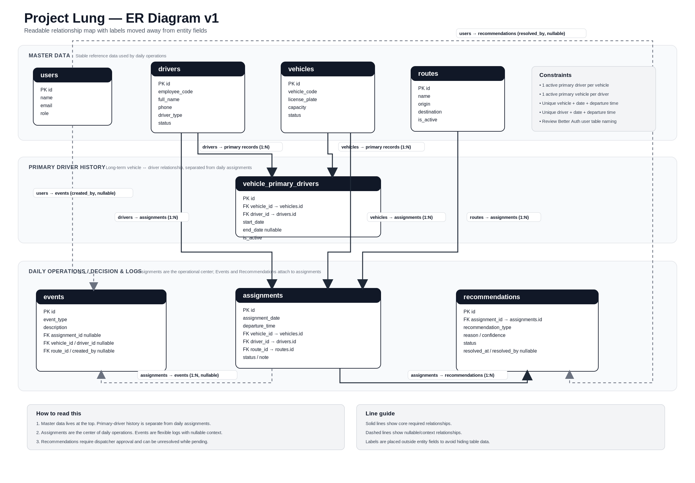
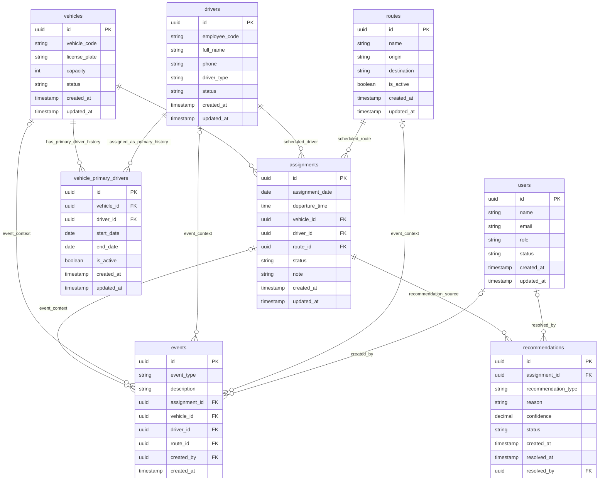

# ER Diagram v1

## Overview

This document is the V1 source of truth for Project Lung database relationships
before Drizzle Schema work begins.

Project Lung is a Decision Support System for EV Bus Dispatch Operations. This
diagram defines the first agreed relationship model for the MVP dispatch flow:
drivers, vehicles, routes, daily assignments, operational events, and
recommendations that require dispatcher review.

[Download SVG](./assets/er-diagram-v1.svg)

Scope:

- Documentation only.
- No schema, migration, or database implementation is defined here.
- Final table names and auth-related user modeling must be reviewed again during
  Better Auth integration.

## High-Level Structure

ER Diagram v1 is organized into three layers:

- Master data: stable reference records used by dispatch operations.
- Primary driver history: long-term vehicle-to-driver pairing history.
- Daily operations, decisions, and logs: scheduled departures, operational
  events, and system recommendations.

The visual diagram uses solid lines for required core relationships and dashed
lines for nullable or contextual relationships. Labels are placed outside entity
boxes so the table fields remain readable in the PNG and SVG assets.

The confirmed V1 core entities are:

- `users`
- `drivers`
- `vehicles`
- `vehicle_primary_drivers`
- `routes`
- `assignments`
- `events`
- `recommendations`

## 1. Master Data

Master data tables hold stable records that daily operations reference. These
tables should change less frequently than assignments, events, and
recommendations.

### users

`users` represents authenticated system users, such as admins and dispatchers.
It is used by operational audit fields, including:

- `events.created_by`
- `recommendations.resolved_by`

Expected user roles include:

- `admin`
- `dispatcher`

Drivers are not the same as authenticated users. A driver can exist as an
operational person even if that driver never signs in to the system.

### drivers

`drivers` stores driver master data.

Driver examples:

- Primary driver
- Reserve driver

Expected driver status values include:

- `active`
- `leave`
- `absent`
- `inactive`

Drivers connect to daily operations through `assignments`. Drivers also connect
to long-term vehicle pairing history through `vehicle_primary_drivers`.

### vehicles

`vehicles` stores EV bus master data.

Expected vehicle status values include:

- `available`
- `running`
- `maintenance`
- `breakdown`
- `inactive`

Vehicles must not store a route directly. A route is chosen for each scheduled
departure, so route assignment belongs in `assignments`, not `vehicles`.

Vehicles also must not store a direct `primary_driver_id`. The primary driver
relationship needs history, so it belongs in `vehicle_primary_drivers`.

### routes

`routes` stores route master data.

MVP route names are color names:

- Green Line
- Red Line
- Blue Line

Routes connect to daily operations through `assignments`. A vehicle can run
different routes across different assignments, so the route relationship is
assignment-specific.

## 2. Primary Driver History

Primary-driver history is separated from daily assignment data because it
describes long-term default pairing, not a single scheduled departure.

### vehicle_primary_drivers

`vehicle_primary_drivers` stores long-term vehicle-to-primary-driver
relationships and preserves history when a vehicle changes its primary driver.

Each record connects:

- `vehicle_id`
- `driver_id`
- `start_date`
- `end_date`
- `is_active`

This table is intentionally separate from `vehicles`. Storing
`primary_driver_id` directly on `vehicles` would overwrite history whenever a
primary driver changes.

This table is also separate from `assignments`. A primary driver is the usual
long-term pairing, while an assignment is one scheduled departure that may use a
reserve driver or temporary replacement.

## 3. Daily Operations / Decision & Logs

Daily operations tables represent the dispatch workflow itself. `assignments`
is the center of this layer.

### assignments

`assignments` represents one scheduled departure, or one dispatch queue item.

An assignment connects:

- `assignment_date`
- `departure_time`
- `vehicle_id`
- `driver_id`
- `route_id`
- `status`
- `note`

`assignments` is the heart of daily operations. It is where the system decides
which vehicle, driver, and route are used for a specific departure time.

Events and recommendations attach to assignments so the team can inspect what
happened and what the system suggested for each dispatch decision.

### events

`events` stores operational log history.

Event examples:

- Driver leave
- Driver absent
- Vehicle breakdown
- Maintenance
- Driver swap
- Vehicle swap
- Manual override
- Recommendation applied

Events are flexible operational logs. They can reference an assignment, vehicle,
driver, route, and creator when those values are known, but some event types may
only have partial context.

Events should be append-only whenever practical so the operations timeline stays
auditable.

### recommendations

`recommendations` stores system-generated or AI-assisted recommendations.

Recommendation examples:

- Replace driver
- Replace vehicle
- Change route
- Assign reserve driver

Expected recommendation statuses include:

- `pending`
- `accepted`
- `rejected`
- `expired`

Recommendations must not modify operations automatically. A dispatcher must
approve or reject the recommendation before it affects the operational plan.

## Mermaid ER Diagram

## Relationship Summary

| From          | To                        | Foreign key                          | Cardinality | V1 rule                |
| ------------- | ------------------------- | ------------------------------------ | ----------- | ---------------------- |
| `drivers`     | `vehicle_primary_drivers` | `vehicle_primary_drivers.driver_id`  | 1:N         | Required               |
| `vehicles`    | `vehicle_primary_drivers` | `vehicle_primary_drivers.vehicle_id` | 1:N         | Required               |
| `drivers`     | `assignments`             | `assignments.driver_id`              | 1:N         | Required               |
| `vehicles`    | `assignments`             | `assignments.vehicle_id`             | 1:N         | Required               |
| `routes`      | `assignments`             | `assignments.route_id`               | 1:N         | Required               |
| `assignments` | `events`                  | `events.assignment_id`               | 1:N         | Nullable event context |
| `assignments` | `recommendations`         | `recommendations.assignment_id`      | 1:N         | Required               |
| `users`       | `events`                  | `events.created_by`                  | 1:N         | Nullable event creator |
| `users`       | `recommendations`         | `recommendations.resolved_by`        | 1:N         | Nullable while pending |

Additional event context relationships are allowed in V1:

- `vehicles` to `events` through `events.vehicle_id`
- `drivers` to `events` through `events.driver_id`
- `routes` to `events` through `events.route_id`

## Important Constraints

Primary-driver constraints:

- One vehicle can have only one active primary driver.
- One driver can be the active primary driver for only one vehicle.
- Future schema work should enforce active uniqueness on `vehicle_id` when
  `is_active = true`.
- Future schema work should enforce active uniqueness on `driver_id` when
  `is_active = true`.

Assignment scheduling constraints:

- `vehicle_id + assignment_date + departure_time` must be unique.
- `driver_id + assignment_date + departure_time` must be unique.

These scheduling constraints prevent assigning the same vehicle or driver to
two departures at the same time.

## Nullable Relationship Rules

Event foreign keys can be nullable because an operational event may only have
partial dispatch context.

Nullable event foreign keys:

- `events.assignment_id`
- `events.vehicle_id`
- `events.driver_id`
- `events.route_id`
- `events.created_by`

Examples:

- A vehicle breakdown event may reference a vehicle but not a driver.
- A driver leave event may reference a driver but not a vehicle.
- A system-generated event may not have `created_by`.

`recommendations.assignment_id` is required in V1 because a recommendation is
attached to an assignment.

The following recommendation fields can be nullable while a recommendation is
`pending`:

- `recommendations.resolved_by`
- `recommendations.resolved_at`

When a recommendation is accepted or rejected, the system should record who
resolved it and when.

## Better Auth Note

`users` is the documentation-level table name for authenticated system users in
this V1 ER diagram.

User table naming must be reviewed again during Better Auth integration. If
Better Auth manages the `users` table itself, Project Lung may need a separate
`user_profiles` table for application-level user data such as display name,
role, and operational preferences.

## What This Diagram Is Not

ER Diagram v1 is not:

- A real database schema.
- A migration.
- A final lock on every field.
- A replacement for Better Auth integration review.

The purpose of this diagram is to create an agreed relationship and structure
baseline before implementation starts.

## Next Step

After ER Diagram v1 passes review, create the first Drizzle Schema work in this
order:

1. Review Better Auth User Table Strategy
2. Create Driver Schema
3. Create Vehicle Schema
4. Create VehiclePrimaryDriver Schema
5. Create Route Schema
6. Create Assignment Schema
7. Create Event Schema
8. Create Recommendation Schema
