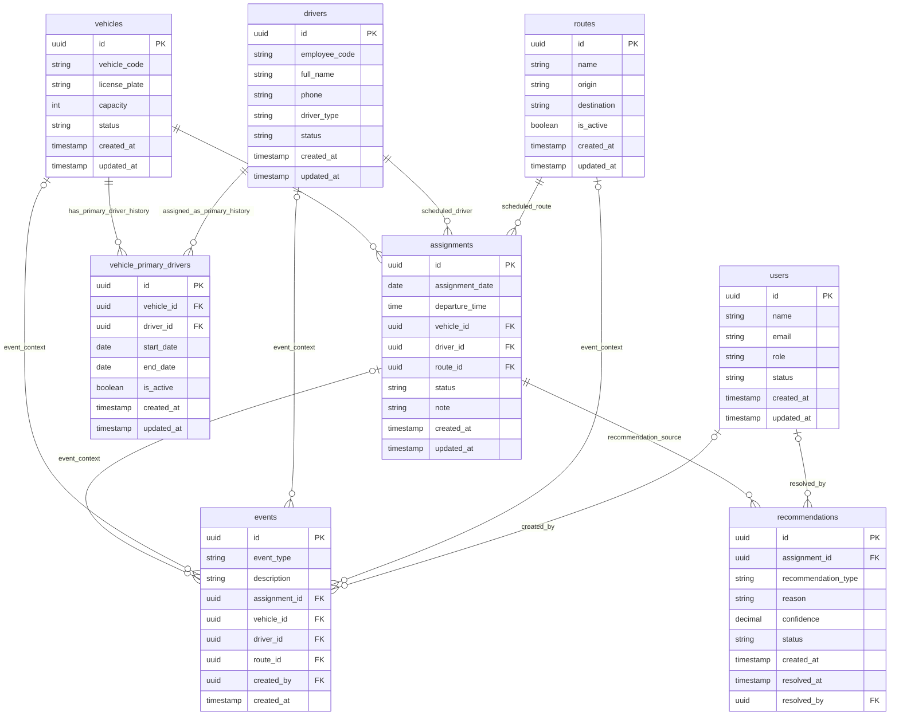

# ER Diagram v1

This document is the V1 source of truth for Project Lung database relationships
before Drizzle Schema work begins.

Scope:

- Documentation only.
- No schema, migration, or database implementation is defined here.
- Final table names and auth-related user modeling must be reviewed again during
  Better Auth integration.

## Core Tables

The confirmed V1 core tables are:

- `users`
- `drivers`
- `vehicles`
- `vehicle_primary_drivers`
- `routes`
- `assignments`
- `events`
- `recommendations`

## Mermaid ER Diagram

## Relationship Matrix

| From          | To                        | Foreign key                          | Cardinality | Required in V1         |
| ------------- | ------------------------- | ------------------------------------ | ----------- | ---------------------- |
| `vehicles`    | `vehicle_primary_drivers` | `vehicle_primary_drivers.vehicle_id` | 1:N         | Yes                    |
| `drivers`     | `vehicle_primary_drivers` | `vehicle_primary_drivers.driver_id`  | 1:N         | Yes                    |
| `vehicles`    | `assignments`             | `assignments.vehicle_id`             | 1:N         | Yes                    |
| `drivers`     | `assignments`             | `assignments.driver_id`              | 1:N         | Yes                    |
| `routes`      | `assignments`             | `assignments.route_id`               | 1:N         | Yes                    |
| `assignments` | `events`                  | `events.assignment_id`               | 1:N         | Nullable               |
| `vehicles`    | `events`                  | `events.vehicle_id`                  | 1:N         | Nullable               |
| `drivers`     | `events`                  | `events.driver_id`                   | 1:N         | Nullable               |
| `routes`      | `events`                  | `events.route_id`                    | 1:N         | Nullable               |
| `users`       | `events`                  | `events.created_by`                  | 1:N         | Nullable               |
| `assignments` | `recommendations`         | `recommendations.assignment_id`      | 1:N         | Yes                    |
| `users`       | `recommendations`         | `recommendations.resolved_by`        | 1:N         | Nullable while pending |

## Entity Notes

### `users`

Stores authenticated system users such as admins and dispatchers.

User roles:

- `admin`
- `dispatcher`

Better Auth may manage its own user table. The final table naming for `users`
must be reviewed during Better Auth integration. If Better Auth owns the auth
user table, application-level user data may move to `user_profiles`.

### `drivers`

Stores driver master data.

Driver types:

- `primary`
- `reserve`

Driver status examples:

- `active`
- `leave`
- `absent`
- `inactive`

Drivers are operational people and are not the same as authenticated `users`.

### `vehicles`

Stores EV bus master data.

Vehicle status examples:

- `available`
- `running`
- `maintenance`
- `breakdown`
- `inactive`

Vehicles must not store route directly. Routes are assigned through
`assignments`.

### `vehicle_primary_drivers`

Stores long-term vehicle-to-primary-driver relationships and preserves history
when a vehicle changes primary driver.

The active relationship is identified by:

- `start_date`
- `end_date`
- `is_active`

### `routes`

Stores route master data.

MVP route names are color names:

- Green Line
- Red Line
- Blue Line

No separate `route_code` is required for V1.

### `assignments`

Stores one scheduled departure.

Assignment is the center of daily operations and connects:

- `assignment_date`
- `departure_time`
- `vehicle_id`
- `driver_id`
- `route_id`
- `status`

### `events`

Stores operational event history.

Event examples:

- Driver leave
- Driver absent
- Vehicle breakdown
- Maintenance
- Driver swap
- Vehicle swap
- Manual override
- Recommendation applied

Events should be append-only whenever practical.

### `recommendations`

Stores system-generated recommendations.

Recommendation examples:

- Replace driver
- Replace vehicle
- Change route
- Assign reserve driver

Recommendation statuses:

- `pending`
- `accepted`
- `rejected`
- `expired`

Recommendations must not modify operations automatically. Dispatcher approval
is required.

## Nullable Relationship Notes

### Event foreign keys

Event foreign keys can be nullable because an operational event may involve only
part of the dispatch context.

Nullable event foreign keys:

- `events.assignment_id`
- `events.vehicle_id`
- `events.driver_id`
- `events.route_id`
- `events.created_by`

Examples:

- A vehicle breakdown event may reference a vehicle but not a driver.
- A driver leave event may reference a driver but not a vehicle.
- A system-generated event may not have `created_by`.

### Recommendation resolver fields

`recommendations.assignment_id` is required in V1.

The following fields can be nullable while a recommendation is `pending`:

- `recommendations.resolved_by`
- `recommendations.resolved_at`

When a recommendation is accepted or rejected, the system should record who
resolved it and when.

## Constraint Notes

### Active primary driver constraints

`vehicle_primary_drivers` must preserve history while enforcing active pairing
rules.

Required active constraints:

- One active primary driver per vehicle.
- One active primary vehicle per driver.

Implementation note for future schema work:

- Enforce active uniqueness on `vehicle_id` when `is_active = true`.
- Enforce active uniqueness on `driver_id` when `is_active = true`.

### Assignment scheduling constraints

One assignment represents one scheduled departure.

Required uniqueness rules:

- `vehicle_id + assignment_date + departure_time` must be unique.
- `driver_id + assignment_date + departure_time` must be unique.

These constraints prevent scheduling the same vehicle or driver for two
departures at the same time.

## Better Auth Note

`users` is the documentation-level table name for authenticated system users in
this V1 ER diagram.

Before implementing Drizzle Schema, user table naming must be reviewed during
Better Auth integration. If Better Auth owns a `user` or `users` table,
application-specific profile fields should move to a separate table such as
`user_profiles`.

## Next Step

Use this ER Diagram v1 as the source of truth for future Drizzle Schema work
after the database design and Better Auth table naming are confirmed.
