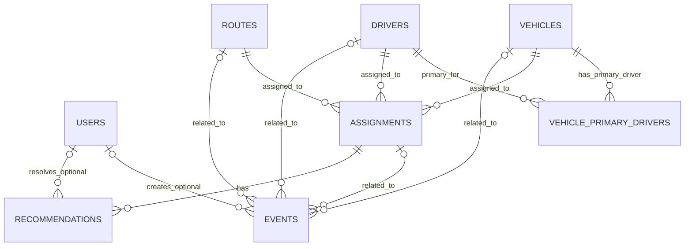

# ER Diagram v1

## Mermaid Draft

## Relationships

### User to Event

One user can create many events.

`events.created_by` may be nullable to support future system-generated events.

### User to Recommendation

One user can resolve many recommendations.

`recommendations.resolved_by` may be nullable while a recommendation is pending.

### Vehicle to VehiclePrimaryDriver

One vehicle can have many primary driver records over time.

Only one should be active at a time.

### Driver to VehiclePrimaryDriver

One driver can be primary driver for one or more vehicles over time.

Only one should be active at a time.

### VehiclePrimaryDriver Active Constraints

VehiclePrimaryDriver stores history with:

- `start_date`
- `end_date`
- `is_active`

Active constraints:

- One vehicle can have only one active primary driver.
- One driver can be active primary driver for only one vehicle.

### Vehicle to Assignment

One vehicle can have many assignments.

### Driver to Assignment

One driver can have many assignments.

### Route to Assignment

One route can have many assignments.

Routes are assigned through Assignments, not Vehicles.

### Assignment Uniqueness

Assignment represents one scheduled departure.

Recommended uniqueness rules:

- `vehicle_id + assignment_date + departure_time` must be unique.
- `driver_id + assignment_date + departure_time` must be unique.

### Assignment to Event

One assignment can have many events.

`events.assignment_id` may be nullable because some events may not belong to a specific scheduled departure.

### Vehicle, Driver, and Route to Event

Events may optionally reference vehicle, driver, and route records.

`events.vehicle_id`, `events.driver_id`, and `events.route_id` may be nullable because an operational event may not involve every entity at once.

### Assignment to Recommendation

One assignment can have many recommendations.

`recommendations.assignment_id` should be required in V1.

`recommendations.resolved_at` and `recommendations.resolved_by` may be nullable while status is `pending`.

## Next Step

Use this ER Diagram as input for future Drizzle Schema work after the database design is confirmed.
