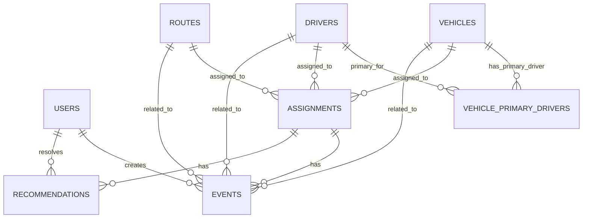

# ER Diagram v1

## Mermaid Draft

## Relationships

### Vehicle to VehiclePrimaryDriver

One vehicle can have many primary driver records over time.

Only one should be active at a time.

### Driver to VehiclePrimaryDriver

One driver can be primary driver for one or more vehicles over time.

### Vehicle to Assignment

One vehicle can have many assignments.

### Driver to Assignment

One driver can have many assignments.

### Route to Assignment

One route can have many assignments.

### Assignment to Event

One assignment can have many events.

### Assignment to Recommendation

One assignment can have many recommendations.

## Next Step

Convert this ER Diagram into Drizzle Schema.
